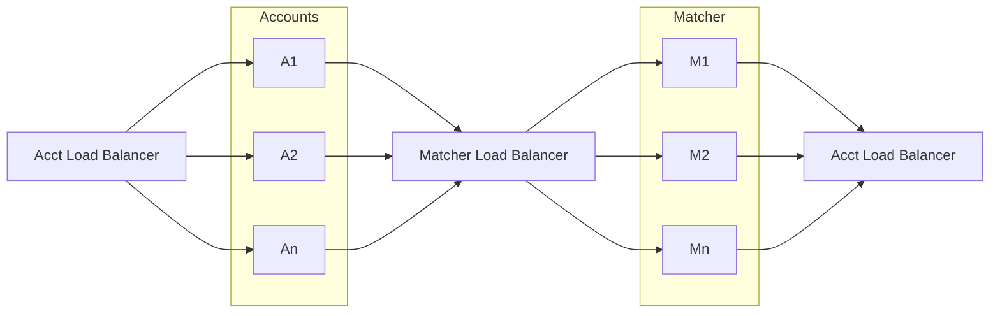
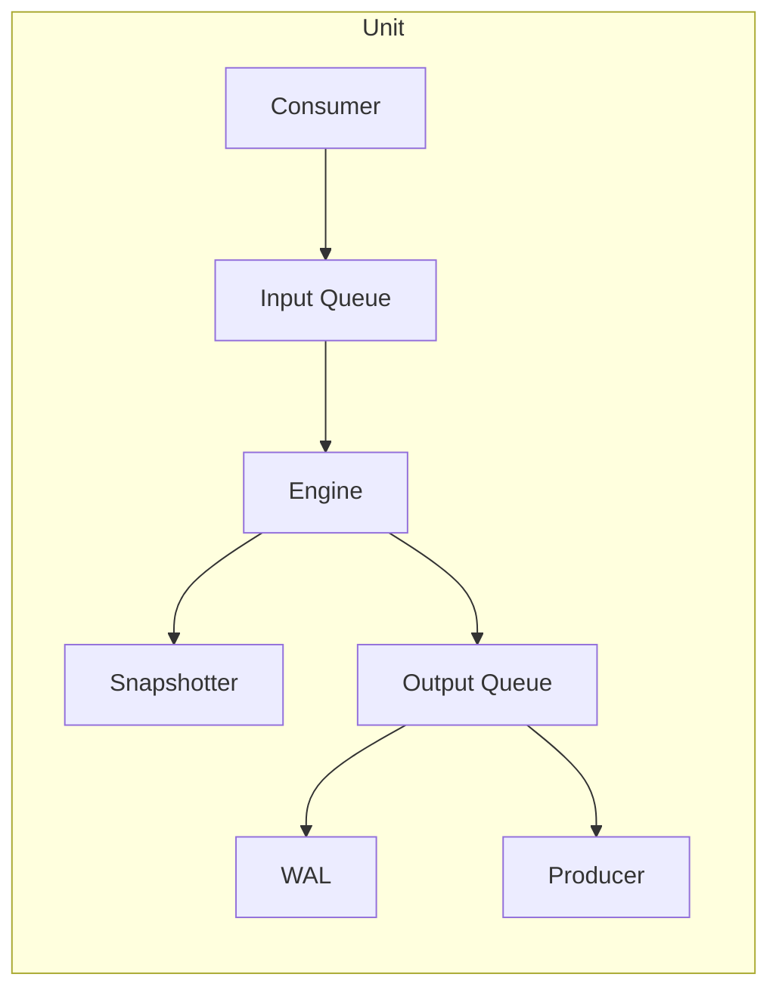

# Exchange

Simple exchange:

- Matching engine
- (soon to be) OMS
- UDP multicast communication with boost asio
- SPSC ring-buffer work queue
- Nix-based dev environment

## Development

To enter a dev shell with all the necessary build tools, use `nix develop`.

## Architecture

### Components

The system is comprised of an accounts system and a matcher system.
Both of these components are sharded and have a load balancer to handle
the routing of messages. The load balancer is also responsible for
retransmission of missed messages, as well as ordering and storing the
input.

### Units

Each unit internally looks as follows:

### Alternative Designs

It would be possible to have the account and matcher parts communicate
directly and for each one to be responsible for storing it's own queue
and broadcasting it to replicas and retransmitters. This sort of design
is discussed in [this talk](https://www.janestreet.com/tech-talks/building-an-exchange/).
